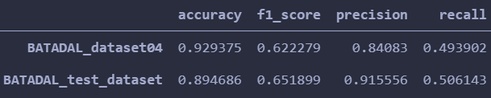
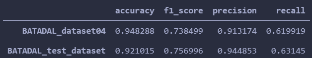
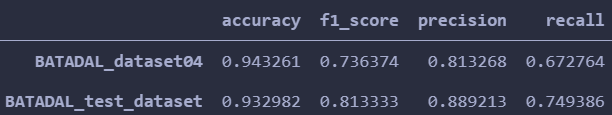

# Experiment records

## Introduction

This is a record for my experiment on BATADAL dataset.

## Code

The code I used is downloaded from https://github.com/rtaormina/aeed. This is the source code for the following publication.

***Taormina, R. and Galelli, S., 2018. Deep-Learning Approach to the Detection and Localization of Cyber-Physical Attacks on Water Distribution Systems. Journal of Water Resources Planning and Management, 144(10), p.04018065.***

The anomaly detection model in the code is AutoEncoder with 7 layers. By checking if the reconstruction error is bigger than the threshold we set, we can tell whether it's an anomaly.

In training phase, it firstly splits BATADAL_dataset03 into train set and validation set. Next, the model is trained with early stop and learning rate decay.

In testing phase, it uses BATADAL_dataset04 and BATADAL_test_dataset for evaluation. Firstly set threshold as **quantile of average reconstruction error on validation set**. Next, compute accuracy, f1-score, precision, recall on these 2 test sets and draw the detection trajectory. Finally, draw the ROC curve and compute AUC under different window size.

## Results

The model is trained for 21 epochs on dataset03. The loss is 0.0011 on both train and val set.

### ROC and AUC

We can see that AUC becomes bigger as window size gets bigger. Window size 12 is the best. But if you care more about reducing the number of false alarms, then window size 3 is better, which can be concluded by the following comparison.

### Acc, f1 score, precision and recall

Window size = 1,

Window size = 3,

Window size = 6,

Window size = 12,

### detection trajectory

Window size = 3,
