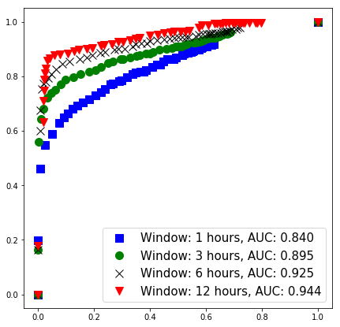
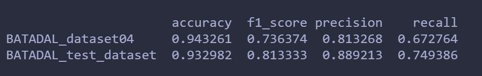
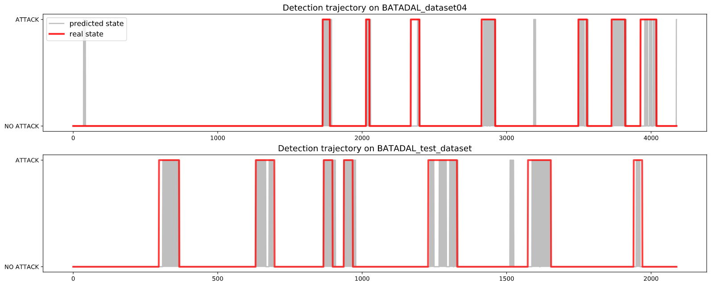

# Experiment-records-on-BATADAL-dataset

## Introduction

This is a record for my experiment on BATADAL dataset.

## Dataset

BATADAL is a time series dataset for anomaly detection. It describes whether the water distribution system is under attack with time going by.

This dataset is proposed in the publication below.
***Taormina R, Galelli S, Tippenhauer N O, et al. Battle of the Attack Detection Algorithms: Disclosing cyber attacks on water distribution networks[J]. Journal of Water Resources Planning and Management, 2018, 144(8).***

Details of this dataset can be found here [https://github.com/scy-phy/www.batadal.net] and here [http://www.batadal.net/].

## Code

The code I used is downloaded from [https://github.com/rtaormina/aeed]. This is the source code for the following publication.
***Taormina, R. and Galelli, S., 2018. Deep-Learning Approach to the Detection and Localization of Cyber-Physical Attacks on Water Distribution Systems. Journal of Water Resources Planning and Management, 144(10), p.04018065.***

The anomaly detection model in the code is AutoEncoder with 7 layers. By checking if the reconstruction error is bigger than the threshold we set, we can tell whether it's an anomaly.

In training phase, it firstly splits BATADAL_dataset03 into train set and validation set. Next, the model is trained with early stop and learning rate decay.

In testing phase, it uses BATADAL_dataset04 and BATADAL_test_dataset for evaluation. Firstly set threshold as **quantile of average reconstruction error on validation set**. Next, compute accuracy, f1-score, precision, recall on these 2 test sets and draw the detection trajectory. Finally, draw the ROC curve and compute AUC under different window size.

## Results

The model is trained for 21 epochs on dataset03. The loss is 0.0011 on both train and val set.

### ROC and AUC

We can see that AUC becomes bigger as window size gets bigger. Window size 12 is the best.

### Acc, f1, precision and recall

When window size = 12, the metrics are shown below.

### detection trajectory

When window size = 12, 
