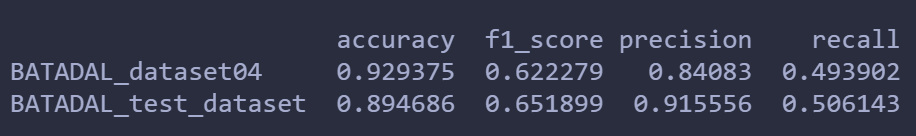
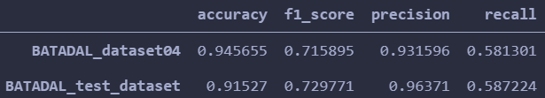
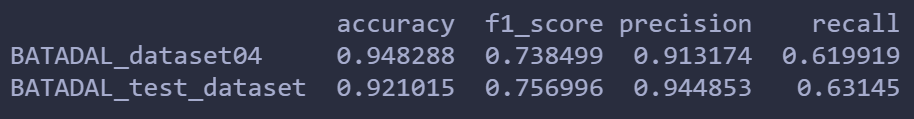
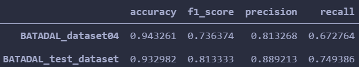
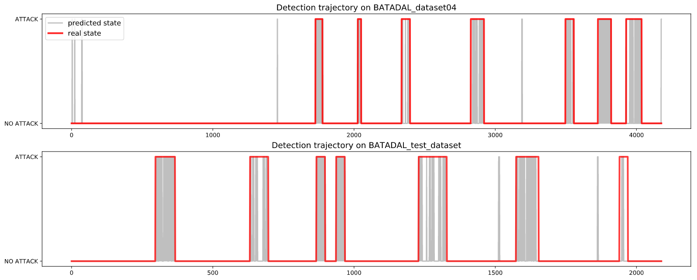
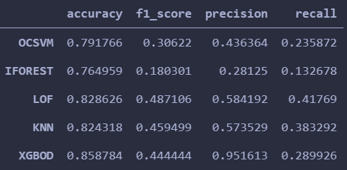
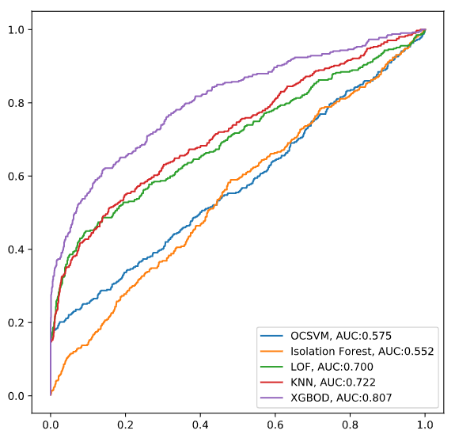

# A survey on BATADAL dataset

## Contents

This survey consists of the following part.

- [A survey on BATADAL dataset](#a-survey-on-batadal-dataset)
  - [Contents](#contents)
  - [Dataset](#dataset)
  - [Summary of researches on BATADAL dataset](#summary-of-researches-on-batadal-dataset)
    - [BATADAL competition](#batadal-competition)
    - [Other researches on BATADAL dataset](#other-researches-on-batadal-dataset)
- [My experiment records](#my-experiment-records)
  - [AutoEncoder](#autoencoder)
    - [Source code](#source-code)
    - [Model](#model)
    - [Train and validate](#train-and-validate)
    - [Test](#test)
    - [Results](#results)
      - [ROC and AUC](#roc-and-auc)
      - [Acc, f1 score, precision and recall](#acc-f1-score-precision-and-recall)
      - [detection trajectory](#detection-trajectory)
  - [Other baseline algorithms](#other-baseline-algorithms)
    - [Implementation](#implementation)
    - [Results](#results-1)
      - [acc, f1 score, precision, recall](#acc-f1-score-precision-recall)
      - [roc and auc](#roc-and-auc-1)

## Dataset

BATADAL dataset is a multivariate time series dataset for anomaly detection in the context of water distribution system. 

This dataset is proposed in the publication below.

***Taormina R, Galelli S, Tippenhauer N O, et al. Battle of the Attack Detection Algorithms: Disclosing cyber attacks on water distribution networks[J]. Journal of Water Resources Planning and Management, 2018, 144(8).***

Details of this dataset can be found here https://github.com/scy-phy/www.batadal.net and here http://www.batadal.net/

## Summary of researches on BATADAL dataset

After that the water distribution systems(WDS) have upgraded from physical systems into cyber-physical systems, WDS is more vulnerable and susceptible to cyber attacks. More specifically, the element named supervisory control and data acquisition systems(SCADA) makes WDS more vulnerable to attacks. Hence there are more needs for developing powerful and reliable cyber-attack detection techniques or systems. Cyber-attacks detection techniques are either model-driven or data-driven.

### BATADAL competition

Here comes the research teams who took the BATADAL competition and introduction of their papers. The results of these research teams can be found on the official website of BATADAL. http://www.batadal.net/results.html

1. Housh et al.

- Paper: ***Model-based approach for cyber-physical attack detection in water distribution systems***

- Idea: Model-driven approach. Firstly estimate the demand based on partial SCADA readings. Secondly simulate the hydraulics based on the estimated demand using *EPANET*, a physically based water hydraulics simulation model. Next calculate the errors between SCADA readings and simulated values. Finally apply moving average with different lags and decision rules on the errors to find anomalies.

2. Abokifa et al.

- Paper: ***Detection of Cyber Physical Attacks on Water Distribution Systems via Principal Component Analysis and Artificial Neural Networks***

- Idea: Data-driven method. 3 layers framework. The first layer is to detect obvious anmalies from statistical perspective using mean and standard deviation. The second is multi-layer perceptron(MLP) used to detect contextual anomalies. The input data is noisy so FFT and third degree low pass Butterworth filter are applied to input data before being fed to MLP. The third layer is PCA, tranforming the principal components into 2 subspaces, normal subspace(the first 14 principal components) and anomaly subspace(the rest). Besides directly applying PCA, the authors also implement leave out one(LOO) algorithm which adds instances of interest to the data to see if it changes the direction of princial components.

- Refinement: In 2018, Abokifa et al. made some improvement on his previous aforementioned work. The improvement is illustrated in the paper ***Real-Time Identification of Cyber-Physical Attacks on Water Distribution Systems via Machine Learning Based Anomaly Detection Techniques***. They refine their idea from the following perspectives, 
    a. add one more module named actuator rules verification, which detect anomalies by checking if the rules are satisfied, e.g. the pump should be ON when the water level in the tank is below a minimum value.
    b. apply semi-supervised learning structure, adding the data that is predicted to be normal to the trusted dataset to retrain the model.
    c. Alarm watch window.

3. Giacomoni et al.

- Paper: ***Identification of Cyber Attacks on Water Distribution Systems by Unveiling Low-Dimensionality in the Sensory Data***

- Idea: Data-driven approach, based on convex optimization.
The first step of the algorithm is to apply actuator rule verification and data verification(some rules set manually to identify whether the system is under attack). If there is no anomaly reported after the first step, then apply an optimization-based detection algorithm to detect attacks further. 

4. Brentan et al.

- Paper: ***On-line cyber attack detection in water networks through state forecasting and control by pattern recognition***

- Idea: Data-driven approach. Apply NARX model to predict the future state of the water distribution system. And then for a series error terms, which are obtained by computing the difference between prediction and measured data, use standard deviation of error terms to detect and localize possible anomalies.

5. Chandy et al.

- Paper: ***Detection of cyber-attacks to water systems through machine-learning-based anomaly detection in scada data***

- Idea: Data-driven approach. It's comprised of 2 parts. The first part is rule-based method, checking if the operation/physical rules are broken. The output is a set of flagged events. It's a bit like the verification step in the algorithm proposed by Giacomni et al. The second part is used to confirm the flagged events. It's composed of a convolutional variational autoencoder. Autoencoder is trained on normal data. Given a new data point, we can determine whether it's an anomaly by the reconstruction probability. 

- Refinement: In 2018, Chandy et al. refined their work by only using variational autoencoder and discarding the rule-based part in their previous work. The refinement is elaborated in the paper ***Cyberattack Detection using Deep Generative Models with Variational Inference***.

6. Posha et al.

- Paper: ***An approach to detect the cyber-physical attack on water distribution system***

-Idea: Data-driven approach. The method consists of 3 modules. The first one is to check if the data point is consistent with the control rules. The second one is pattern recognition. The model is trained on normal data to define normal behavior patterns. The third one is developed based on the relationships between the components of water distribution systems. This part is for confirming the attack events detected by the aforementioned modules.

7. Aghashahi et al.

- Paper: ***Water distribution systems analysis symposium-battle of the attack detection algorithms (BATADAL)***

- Idea: Data-driven approach. The algorithm is composed of 3 parts. The first part is to preprocess the data. It's actually to remove the time and flag attributes in the input .csv file. The second part is to train a random forest. Here is how they get input training data ready. Firstly compute average lag-0 covariance matrix A for normal series and average lag-1 covariance matrix B for anomalous series. Then for a time point t, compute lag-0 covariance matrix C for it. Finally the input data for RF is (||C-A||, ||C-B||). The third part is to test the model.

### Other researches on BATADAL dataset

In this section, some other researches using BATADAL dataset is shown below. Although these research teams didn't participate in the competition, their work has something to do with BATADAL dataset.

This section still needs to be completed.

1. Abdulaziz Almehmadi.

- Paper: ***SCADA Networks Anomaly-based Intrusion Detection System***

- Idea: Treat the intrusion detection task as binary classification. They firstly extract some features from SCADA readings manually and then apply PCA to select some crucial features. Finally train naïve bayes, svm and random forest separately to see which algorithm performs the best. And random forest can mitigate the impact that imbalanced data has so it performs the best compared with naïve bayes and svm.

2. Erba et al.

- Paper: ***Real-time Evasion Attacks with Physical Constraints on Deep Learning-based Anomaly Detectors in Industrial Control Systems***

- Idea: This paper is different from papers above since it focuses on the techniques to **evade detection** rather than detect anomalies. In the paper, the authors proposed white box and black box attack algorithms to evade detection of the system. It's an very interesting work. As for white box, since the assumption is attackers know how detection system is performed, they modify some variables of the anomalous data in order to craft hard-to-recognize anomalies. As for black box, they use adversarial trained autoencoder to generate anomalies with pertubations. In terms of evaluation, they use BATADAL dataset and WADI dataset.

3. Taormina et al.

- Paper: ***Deep-Learning Approach to the Detection and Localization of Cyber-Physical Attacks on Water Distribution Systems***

- Idea: Data-driven approach. They apply AutoEncoder to the BATADAL dataset to detect and localize the anomalies. In my following experiment on BATADAL, I use the source code of this paper to see how it performs on BATADAL dataset. 

 

# My experiment records

In my experiment, AutoEncoder and some other algorithms like LOF are applied to BATADAL dataset. Let's see how well they perform!

## AutoEncoder

### Source code

The code I use is downloaded from https://github.com/rtaormina/aeed. This is the source code for the following publication.

***Taormina, R. and Galelli, S., 2018. Deep-Learning Approach to the Detection and Localization of Cyber-Physical Attacks on Water Distribution Systems. Journal of Water Resources Planning and Management, 144(10), p.04018065.***

### Model

The anomaly detection model in the code is AutoEncoder with 7 dense-connected layers. The input and output dimensions are both 43 since input time series have 43 variables. 

It's a prediction-based method. It's trained on normal data to learn its pattern. Reconstruction error equals to output minus input. If input x has dissimilar pattern with the training data, its reconstruction error should be huge and thus x is an anomaly. So by checking if the reconstruction error is bigger than the threshold we set, we can tell whether it's anomalous data or not. However, It's very tricky to set a proper threshold. The author set threshold as quantile of reconstruction errors on validation set. (perhaps better to utilize the reconstruction errors of both train and val set?)

### Train and validate

In training phase, firstly split BATADAL_dataset03 into train set and validation set. Then normalize the data. Next, the model is trained with early stop and learning rate decay. The optimizer is Adam and loss function is Mean Square Error. For each epoch, losses on train set and val set are calculated.

Note that while training, we don't need labels of the sequences explicitly since AE is self-supervised. Input is also the groundtruth.

### Test

In testing phase, it uses BATADAL_dataset04 and BATADAL_test_dataset for evaluation. Firstly set threshold as quantile of the reconstruction errors on validation set. Then apply moving average to the recontruction errors and compare errors with threshold to make predictions. Next, compute accuracy, f1-score, precision, recall on these 2 test sets and draw the detection trajectory. Finally, draw the ROC curves and compute AUC under different **window sizes**.

In terms of drawing the ROC curve, a few different thresholds need to be set. For each of the thresholds, compare it with the reconstruction errors on test set to make predictions. Next compare the predictions with labels and we can get a (false positive rate, true positive rate) pair for one threshold. Finally, these pairs constitute one ROC curve.

For window size, it's related to moving average. Moving average is applied to the reconstruction errors before comparing with threshold and we can get a smoothed error sequence. The window size is a hyperparameter and multiple ROC curves and AUCs are generated under different window sizes.
 

### Results

The model is trained for 21 epochs on dataset03. The loss is 0.0011 on both train and val set.

#### ROC and AUC

 

We can see that AUC becomes bigger as window size gets bigger. Window size 12 is the best from the perspective of AUC. But if you care more about reducing the number of false alarms, then window size 3 is better, which can be concluded by the following comparison.

#### Acc, f1 score, precision and recall

Window size = 1,

Window size = 3,

Window size = 6,

Window size = 12,

#### detection trajectory

Window size = 3,

 
 

## Other baseline algorithms

In this section, I apply 5 algorithms, one-class svm, isolation forest, LOF, KNN and XGBOD to BATADAL dataset to see their performance. My code is here. https://github.com/SYChen123/Baseline-outlier-detection-algorithms-on-BATADAL-dataset

### Implementation

All these algorithms are implemented in pyod. pyod assumes that the training data is more or less contaminated. Therefore, I use dataset04 to train the models and test_dataset to evaluate.

### Results

#### acc, f1 score, precision, recall

#### roc and auc

